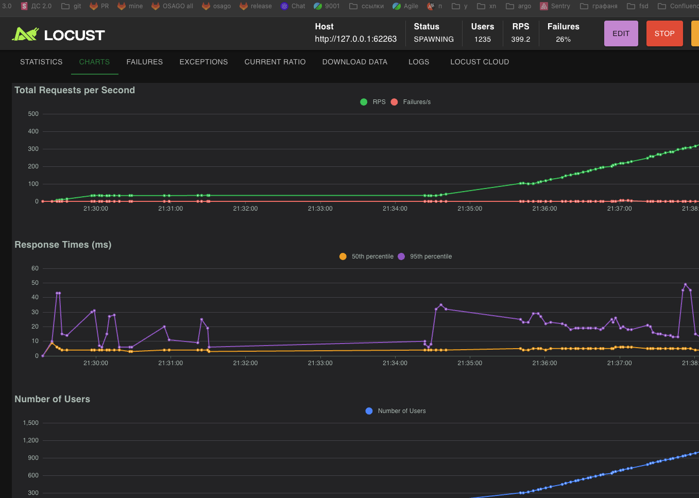
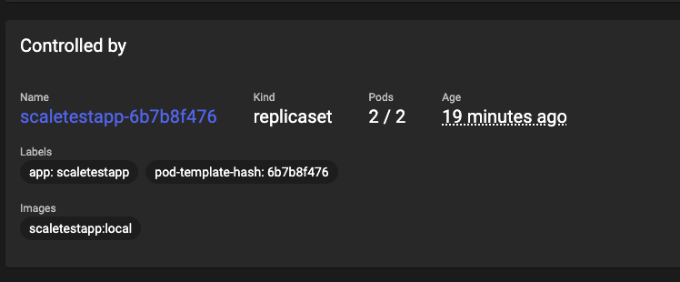

## Подготовка к запуску

### 1. Сборка docker-образа для arm64

1. Клонирование репозитория приложения:
   ```bash
   git clone https://github.com/yandex-practicum/scaletestapp.git
   cd scaletestapp
   ```
2. Сборка под архитектуру:
   ```bash
   docker build --platform linux/amd64 -t scaletestapp:local .
   ```
3. Загрузка образа в Minikube:
   ```bash
   minikube image load scaletestapp:local
   ```

### 2. Применение манифестов

1. Применитьманифесты:
   ```bash
   kubectl apply -f deployment.yaml
   kubectl apply -f service.yaml
   kubectl apply -f hpa.yaml
   ```
1. Убедиться что все поды поднялись
   ```bash
   kubectl get pods
   ```

### 3. Тестирование масштабирования

1. Получить URL сервиса:
   ```bash
   minikube service scaletestapp-service --url
   ```
2. Запустить Locust для генерации нагрузки

```bash
locust
```

locust откроется http://localhost:8089

3.  Открыть Minikube dashboard:

### Результаты

```bash
minikube dashboard
```

Нагрузка


логи
[text](hpa_describe.txt)

скрин

